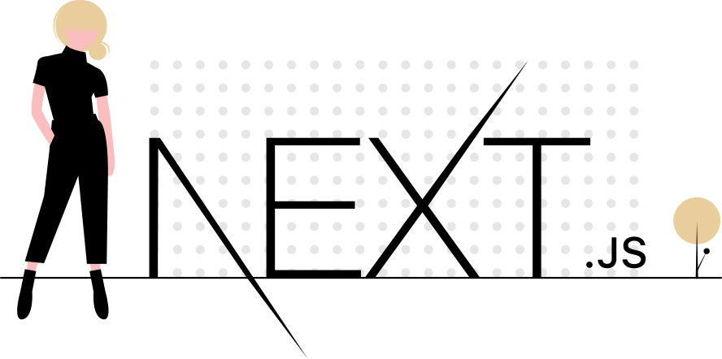

# T r i n W i n

> Personal Website In Progress 🛠

<p align="center">
    
</p>

## Using

- Client-side navigation
- Code splitting
- Pre-fetching
- Pre-rendering
- Data fetching at build/request time
- SWR
- Dynamic Routes
- API Routes
- Deploy app on Vercel

## Quick Start

```bash
# Install dependencies
npm install

# Serve on localhost:3000
npm run dev

# Build for production
npm run build
```

## Deployment

App is deployed on Vercel. You can check it out here: https://nextjs-blog-six-xi.now.sh/
